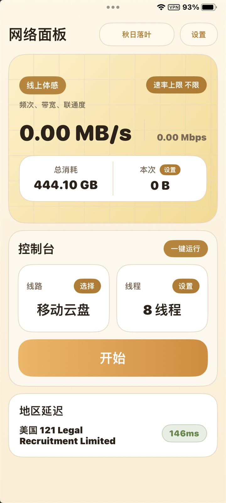
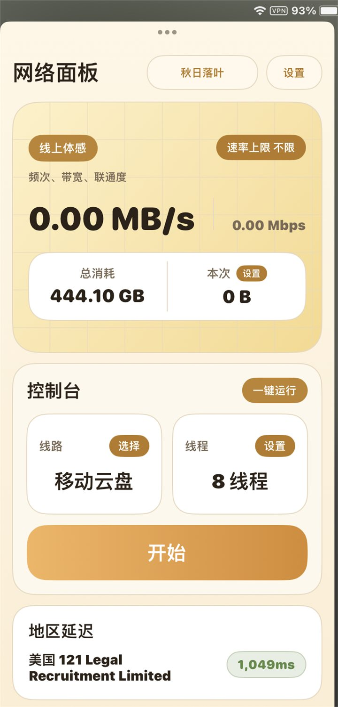
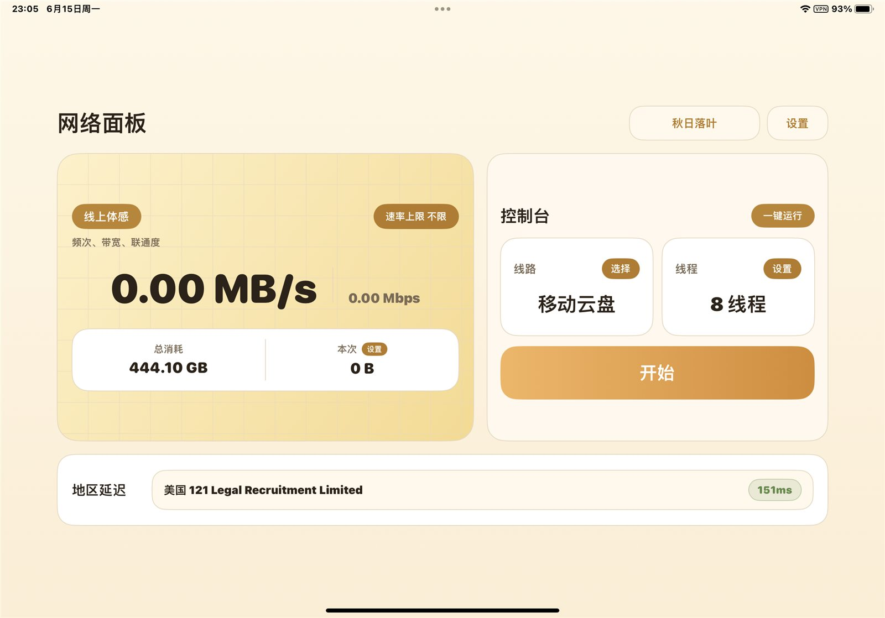

# 网络面板 iOS

网络面板是一个面向 iPhone 和 iPad 的原生 SwiftUI 网络工具，用于查看实时速率、管理测试线路、记录数据用量，并辅助判断当前网络连接质量。

## 功能

- 实时速率显示：同时展示 `MB/s` 与 `Mbps`，便于快速观察当前网络吞吐状态。
- 数据用量统计：分别记录累计用量与本次会话用量，支持手动清零。
- 线路管理：支持添加、编辑、删除、选择和批量导入不同的测试地址，适合对比多条网络线路的可用性。
- 线程设置：可调整并发线程数，便于在不同网络环境下进行强度控制。
- 速率上限：支持设置 Mbps 级别的速率限制，避免测试过程占用过多带宽。
- 地区延迟检测：自动检测可用地区节点延迟，检测不到时不会展示无效数据。
- 多主题外观：内置多套浅色和深色主题，适配不同使用环境。
- iPad 适配：支持横屏布局、分屏显示和 iPadOS 多窗口使用场景。
- 后台音频模式：运行时启用音频后台能力，用于提高息屏或切后台后的持续可用性。
- GitHub Actions 构建：推送版本标签后自动生成未签名 IPA，方便自签和侧载。

## 界面预览

<p>
  
  
  
</p>

<p>
  
</p>

<p>
  
</p>

## 下载安装

在 GitHub Release 中下载最新的 `network-panel-ios-*-unsigned.ipa` 文件，然后使用你自己的自签或侧载工具签名安装。

## 相关项目

- Android 项目：[youko-nobody/network-panel](https://github.com/youko-nobody/network-panel)
- iOS 项目：[youko-nobody/network-panel-ios](https://github.com/youko-nobody/network-panel-ios)

## 构建说明

项目使用 XcodeGen 生成 Xcode 工程，并通过 GitHub Actions 在 macOS 环境中构建。

```powershell
git tag v0.1.x
git push origin main
git push origin v0.1.x
```

构建完成后，Release 页面会自动附带未签名 IPA。

## 注意

本项目不包含任何私人证书、签名文件或 provisioning profile。后台持续运行能力受 iOS / iPadOS 系统策略影响，实际表现可能因设备、电量模式、系统版本和网络环境而不同。
